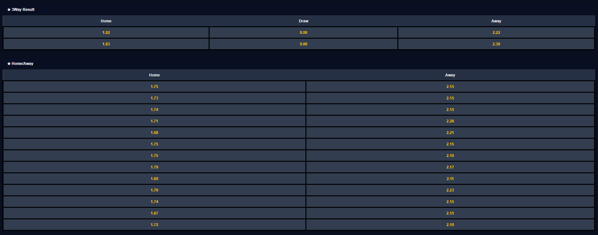

# Dynamic Odds Table App

A simple React application that loads and displays football match odds from a local `data.json` file. It allows you to search for matches and view structured tables of odds data by bookmaker and type.

---

##  Features

- ✅ **Load and parse odds data from `data.json`**
- ✅ **Auto-generate table headers** using dynamic bookmaker and odd type values
- ✅ **Search matches** by Match ID or team name
- ✅ **Real-time search suggestions** while typing
- ✅ **Display structured odds tables** for the selected match

---

##  Installation

### Prerequisites

- Node.js (>= 14.x)
- npm (>= 6.x)

### Setup Steps

```bash
# 1. Clone the repository
git clone https://github.com/saanchita-paul/oddmatch.git

# 2. Navigate into the project directory
cd oddmatch

# 3. Install dependencies
npm install

# 4. Start the development server
npm start


### Output

